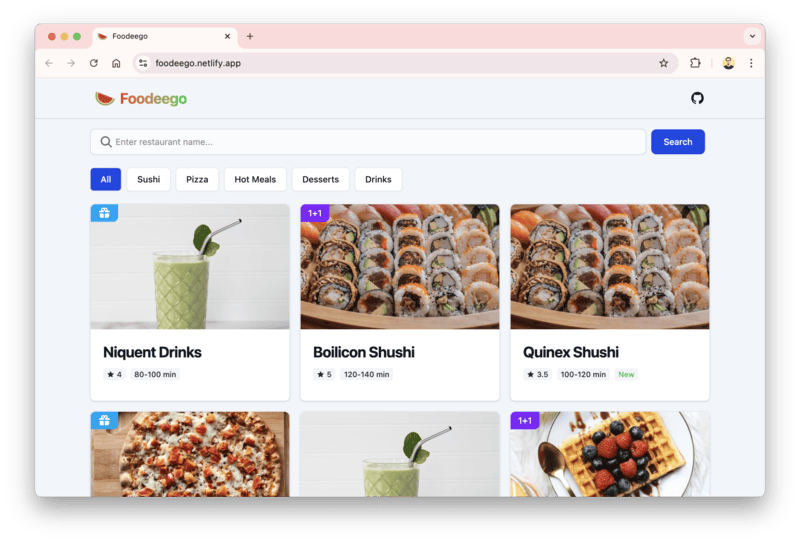

# 🍉 Foodeego

 

Just another food catalog sample for e-commerce

## 🌎 Live

https://foodeego.netlify.app/

## 📚 Tech Stacks

- React + TypeScript + Vite
- Tailwind CSS for styling
- SWR for data fetcher
- Vitest for unit testing

## ✨ Features

- See all available foods
- Filter by category
- Search by keyword
- Cached API (24 hours lifetime)
- Shareable filter URL

---

©️ 2025, By Irfan Maulana